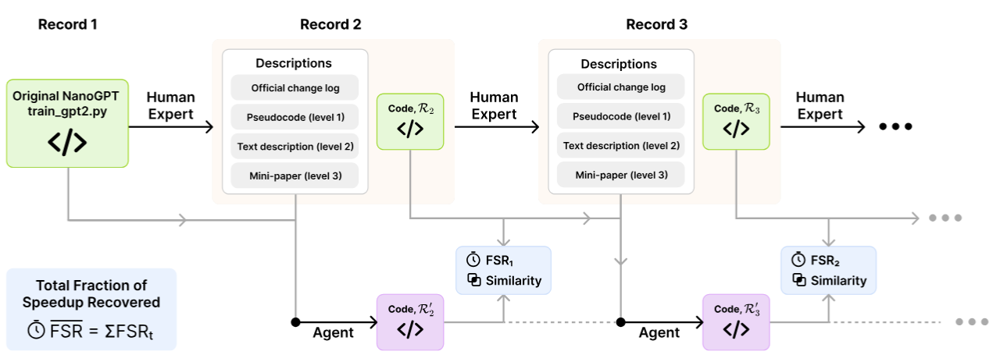
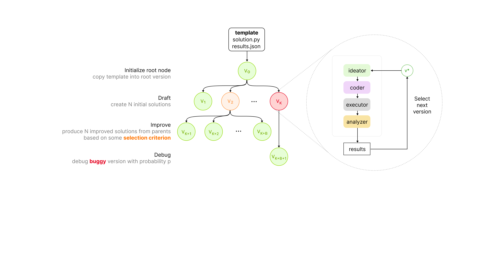

# 🏃‍♀️ LLM Speedrunner


This respository hosts the code and benchmark data for the arXiv paper "The Automated LLM Speedrunning Benchmark: Reproducing NanoGPT Improvements". In this paper, we introduce a benchmark which measures the ability of an LLM agent to reproduce scientific results in the area of LLM pretraining. The diagram below provides a high-level overview of the benchmark tasks.

<div align="center">
    
</div>

In order to assess the performance of frontier reasoning LLMs on our benchmark, we build a flexible search scaffold that enables the implementation of LLM agents that solve the benchmark tasks. The following image visualises the search carried out by our agent in the solution space and the various stages of each node in the search tree.

<div align="center">
    
</div>


## Folder structure

The structure of the folder is as follows:
- `config`, `core`, `util` contains code and configurations to run the experiments
- `data/nanogpt_speedrun_knowledge_in_levels` and `workspace_templates/nanogpt_speedrun` contain the benchmark data that are fed as input to the agent
- `launchers` contains the scripts for launching the baseline and additional experiments and the conda environments for the experiments.
- `data_analyses` contains the jupyter notebooks for running the analyses and generating the plots of the paper
- the rest of README provides generic instructions for usage of the agent


## Setup

### Clone the repo and create conda environments
```
    git clone git@github.com:facebookresearch/llm-speedrunner.git
    cd llm-speedrunner
```
See `launchers/conda_envs/README.md` about how to create a conda environment for the various records.

### Setup API keys

Copy `config/secrets/default.template.yaml` to `config/secrets/default.yaml` and add API keys to it. Note that `config/secrets/` is added to `.gitignore` (with the exception of `config/secrets/default.template.yaml`) to avoid accidentally pushing the keys to github.

## Run examples

Run the LLM speedrunner for the first record of the benchmark:
```
python launch_scientist.py model=o3_mini task=nanogpt_speedrun/record_1
```

### AIDE
To run with AIDE-style search, explicitly set the science_runner type to `aide`:
```bash
python launch_scientist.py \
	model=o3_mini \
	science_runner=aide \
	task=nanogpt_speedrun/record_1
```

### Knowledge sources
To pass in external knowledge sources that then inform the idea generation stage, pass in a list of file paths or glob strings to the source files (note the quotations around the argument and value here):
```bash
python launch_scientist.py \
	model=r1_32b \
	task=nanogpt_speedrun/record_1 \
	knowledge_src_paths=["data/nanogpt_speedrun_knowledge_in_levels/record_1/level_1_*.txt"]
```

See the available models and tasks under `config/model` and `config/task` respectively. You can pass the name of any of these yaml files (without the extension) as the value for `launch_scientist.py`'s' model and task command-line arguments.

## Design
The automated "science loop" consists of a few common stages:

**Ideation:** Generating new ideas for hypotheses to test and implementation changes to try (please note that we disable this stage for the NeurIPS submission experiments, by using a dummy ideator)

**Experiment implementation:** Coding the experiments that test the ideas produced in the ideation stage.

**Experiment execution:** Running the code that implements the experiments.

**Results analysis:** Extracting insights from the output of the executed experiments.

This codebase is designed with the following goals in mind:
- Quick iteration speed
- Minimal external dependencies
- Allows easy, reproducible evaluation of each science loop stage, both in isolation and as part of a complete scientist loop.
- Allows mixing and matching different strategies for each science loop stage.
- Clearly tracks all artifacts produced by the scientist at each stage (see workspaces design below)
- Plays nicely with Slurm


### The core science loop
The science loop can be implemented via either of two existing runners (or with any custom logic via your own subclass of `ScienceRunner`):
- `ScienceRunner` is unstructured in its run logic, allowing for maximum flexibility.
- `BoNScienceRunner` inherits from `ScienceRunner`, and follows a set, structured sequence of steps corresponding to the common stages above, with freedom around how often they are each run and parallelized per iteration. In particular, a batch `n_hypotheses` hypotheses are generated in a single iteration, and a `selection_metric` can be defined via the `ExperimentConfig` passed into the runner in order to select the best hypothesis found so far. This hypothesis is then used as the starting point for the the next iteration of the science loop.

In the `BoNScienceRunner`, ideation and implementation are handled by instances of the `Ideator` and `Coder` classes respectively, which all subclass `Agent` (see the Agent section below). The modules `core.ideators` and `core.coders` serve as central registries for Ideator and Coder subclasses, making it easy to define combinations of ideator and coder strategies, which can all be set with a single line in the top-level hydra config. Moreover, the `BoNScienceRunner` also receives a simple instance of `Agent` (under the `assistant` property), which is used for handling one-off LLM queries.

#### Why explict modules?
Having explicit implementations for `Ideator` and `Coder` variants is useful, as these strategies will be valuable to run in isolation, either for the purposes of evaluation (per-stage evals) or for handling independent endpoints in downstream integrations (e.g. giving Metamate an "ideation" or "experiment implementation" skill).


### Agents
Each system-prompted LLM instance is abstracted as an agent, with an `act` method, which takes a prompt (e.g. instruction) and optionally a _validator function_ and a value for `max_retries`. The validator function returns a string value, that can be an arbitrary post-processed version of the LLM response to the prompt, and it should return `None` to mark the response as invalid. The method `act` will then retry querying the LLM with the prompt a maximum of `max_retries` times.


### Versioned workspaces
Each scientist run is encapsulated in its own subdirectory inside the `workspaces` directory (auto-generated on first run).

Each experiment implemented by the scientist during a run corresponds to a _version_ of an initial _workspace template_, a directory of files and potentially nested subdirectories. Workspace templates provides the initial project contents that serve as a starting point for the scientist to begin its experimentation.

When the workspace is first created, `v_1` (version 1) is initialized by copying the specified workspace template. Each experiment iteration corresponds to branching (i.e. copying) the previous version into a new version (e.g. `v_1 -> v_2`) and making changes in the new version directory. In this way, workspaces track the full history over arbitrary trees of codebases that may be created during the course of a scientist run.
