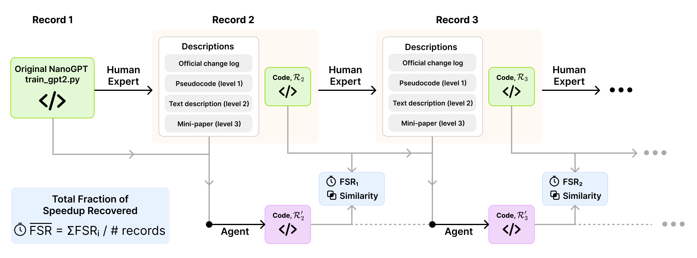
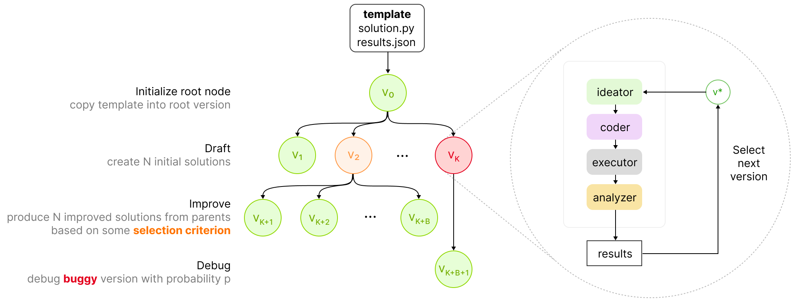

# ⚡️ LLM Speedrunner

<p align="center">
  <a href="https://creativecommons.org/licenses/by-nc/4.0/deed.en"></a>
  <a href="https://arxiv.org/abs/2506.22419"></a>
</p>

The Automated LLM Speedrunning Benchmark turns the [NanoGPT Speedrun](https://github.com/KellerJordan/modded-nanogpt) into an eval for the ability of frontier LLM agents to reproduce scientific findings. In this benchmark, an LLM agent is tasked with reproducing the innovations behind each of the NanoGPT Speedrun records, when given access to a description of the innovation. These hints can be set to any of three formats: pseudocode of the change (level 1), text description (level 2), markdown paper describing the improvement (level 3). Currently, no frontier model is capable of reproducing the human-driven speedrun, even when given the pseudocode hints.

When run without any hints, this benchmark further serves as an open-ended evaluation of an LLM's ability to produce new innovations in the important domain of language modeling.

You can read more about this benchmark in our paper, ["The Automated LLM Speedrunning Benchmark: Reproducing NanoGPT Improvements"](https://arxiv.org/abs/2506.22419). The diagram below provides a high-level overview of the structure of the benchmark tasks.

<div align="center">
    
</div>


## Folder structure

| Folder                                      | Contents                                                                                            |
| ------------------------------------------- | --------------------------------------------------------------------------------------------------- |
| `config`                                    | Hydra configuration files for every module involved in running an experiment                        |
| `core` & `util`                             | Source code that implements the agent‑scaffolding logic                                             |
| `workspace_templates`                       | Starter workspaces for tasks (e.g., speed‑run tasks live in [`workspace_templates/nanogpt_speedrun`](workspace_templates/nanogpt_speedrun)) |
| `data/nanogpt_speedrun_knowledge_in_levels` | Hint data used by the speed‑run tasks                                                               |
| `conda_envs`                                | Conda environment requirement files, one per speed‑run task set                                     |
| `launchers`                                 | Convenience launch scripts for different experiment settings                                        |
| `analysis`                                  | Jupyter notebooks that generate the analyses and plots presented in the paper                       |


## Setup

### Clone the repo and create conda environments
```
git clone git@github.com:facebookresearch/llm-speedrunner.git
cd llm-speedrunner
```

Different sets of records (records 1 – 11, records 12 – 18, and records 19 – 21) require slightly different dependencies and therefore separate conda environments:

#### Records 1 – 11
```bash
# For records 1 – 11
conda env create -f conda_envs/speedrunner-1-11/environment-1-11.yml
conda activate record-1-11
pip install -r pip_requirements-1-11.txt
```

#### Records 12 – 18
```bash
cd 
conda env create -f conda_envs/speedrunner-12-18/environment-12-18.yml
conda activate record-12-18
pip install -r pip_requirements-12-18.txt
```

#### Records 19 – 21
The conda environment for records 19 – 21 requires the nightly build of `torch`, which we install from conda-pack as follows:

```bash
## conda-unpack to rebuild the environment
mkdir -p ~/path/to/envs/environment-19-21
tar xzvf speedrunner-19-21.tar.gz -C ~/path/to/envs/environment-19-21
~/path/to/envs/environment-19-21/bin/conda-unpack

## Activate the environment
source ~/path/to/envs/environment-19-21/bin/activate

## Alternatively, the following command can be used to link the environment to existing conda, then conda activate can be used
conda config --append envs_dirs ~/path/to/envs
conda activate environment-19-21
```

### Configure API keys

Copy [`config/secrets/default.template.yaml`](config/secrets/default.template.yaml) to `config/secrets/default.yaml` and add your API keys for the relevant LLM providers to it. Note that `config/secrets/default.yaml` is already included in `.gitignore`.


## Examples

### AIDE
Run AIDE with o3-mini on the first record for 5 search iterations:
```bash
python launch_scientist.py \
	model=o3_mini \
	science_runner=aide \
	task=nanogpt_speedrun/speedrun_record_1 \
	n_iterations=5
```

### External knowledge sources
You can pass in external knowledge sources as a list of file paths or glob strings. 
This command runs AIDE with o3-mini on the first record with the external knowledge for hint level 1 (the pseudocode of the changes needed to arrive at the next record). Note the quotations around the `knowledge_src_paths` argument here are important.
```bash
python launch_scientist.py \
	model=o3_mini \
	task=nanogpt_speedrun/speedrun_record_1 \
	knowledge_src_paths=["data/nanogpt_speedrun_knowledge_in_levels/record_1/level_1_*.txt"]
```


For the NanoGPT speedrunning tasks, the knowledge source for the level L hint for record R is located at [`data/nanogpt_speedrun_knowledge_in_levels/record_{R}/level_{L}_*.txt`](data/nanogpt_speedrun_knowledge_in_levels).


### Experiments from the paper
We provide Slurm launch scripts for the various experiments from the paper in [`launchers/`](launchers).


## Extending the framework

### Adding a model

After adding a model config for your model at `config/model/your_model.yaml`, you can launch an experiment with your model via `launch_scientist.py model=your_model`.

### Adding a task

1. Create a new folder under `workspace_templates/` with the same name as the task name. This folder is the _workspace_template_ containing the set of starting files available to the agent. Whatever is in the task's workspace template is copied into the `v_0` workspace (the contents of the root search node) in the search scaffold. 

2. Create a task config at `config/task/your_task.yaml` (with `# @package _global_` at the top). Refer to the existing configs for some examples, e.g. [`task/collatz.yaml`](config/task/collatz.yaml) defines a task whose solution code runs on CPUs, whereas the tasks under [`task/nanogpt_speedrun`](config/task/nanogpt_speedrun) require GPUs and is launched via `torchrun`. The exact launch configuration for the solution code can be configured via the `slurm_config_args` parameter (see [`task/nanogpt_speedrun/default_config.yaml`](config/task/nanogpt_speedrun/default_config.yaml) for an example).

You can then launch an experiment for your task via `launch_scientist.py task=your_task`.

### Custom coders

Coding agents are any subclass of [`core.agent.Agent`](core/agent.py) that implements the `code` method. See the base [Coder](core/coders/base.py) and [Aider](core/coders/aider.py) agents for examples. To integrate a custom coding agent, do the following:

1. Implement your custom coding agent at `coders/your_coder.py`.
2. Add a default configuration for this agent at `config/coder/your_coder.yaml`.

You can then launch an experiment for any task by specifying your coder via `launch_scientist.py task=nanogpt_speedrun/speedrun_record_1 coder=your_coder`.


## Agent scaffold design

<div align="center">
    
</div>

The scientist agent scaffold implements an experimentation loop consisting of a few stages:

**Ideation:** Generating new ideas for hypotheses to test and implementation changes to try (We disable this stage in our reproducibility experiments by setting the ideator to `dummy`, as the ideas are provided directly by the hints).

**Experiment implementation:** Coding the experiments that test the ideas produced in the ideation stage.

**Experiment execution:** Running the code that implements the experiments.

**Results analysis:** Extracting insights from the output of the executed experiments.

The core agent scaffold logic resides in the (`BoNScienceRunner`)[core/runners/bon_science_runner.py], while ideation and implementation are handled by instances of the `Ideator` and `Coder` classes respectively, which all subclass `Agent` (see the Agent section below). The modules `core.ideators` and `core.coders` serve as central registries for Ideator and Coder subclasses, making it easy to define combinations of ideator and coder strategies, which can all be set with a single line in the top-level hydra config. Moreover, the `BoNScienceRunner` also receives a simple instance of `Agent` (under the `assistant` property), which is used for handling one-off LLM queries.


### Agents
Each system-prompted LLM instance is abstracted as an agent, with an `act` method, which takes a prompt (e.g. instruction) and optionally a _validator function_ and a value for `max_retries`. The validator function returns a string value, that can be an arbitrary post-processed version of the LLM response to the prompt, and it should return `None` to mark the response as invalid. The method `act` will then retry querying the LLM with the prompt a maximum of `max_retries` times.

### Versioned workspaces
Each scientist run is encapsulated in its own subdirectory inside the `workspaces` directory (auto-generated on first run).

Each experiment implemented by the scientist during a run corresponds to a _version_ of an initial _workspace template_, a directory of files and potentially nested subdirectories. Workspace templates provides the initial project contents that serve as a starting point for the scientist to begin its experimentation.

When the workspace is first created, `v_0` (version 0) is initialized by copying the specified workspace template. Each experiment iteration corresponds to branching (i.e. copying) the previous version into a new version (e.g. `v_0 -> v_1`) and making changes in the new version directory. In this way, workspaces track the full history over arbitrary trees of codebases that may be created during the course of a scientist run.


## License
This codebase uses the [CC BY-NC 4.0](LICENSE) license.
